<div align="center">

# Momentum Hub

</div>


A powerful, modern CLI habit tracker designed for building and maintaining daily and weekly habits. Track progress, analyze patterns, set goals, and stay motivated with rich analytics and an intuitive interface.


[](https://www.python.org/downloads/)
[](https://opensource.org/licenses/MIT)
[](https://github.com/aaronmalunga/momentum-hub/actions/workflows/tests.yml)


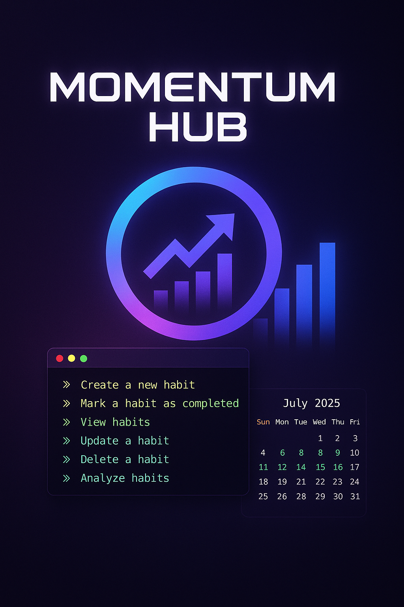


## 1. Key Features

- **Advanced Analytics**: Track streaks, completion rates, and visualize progress with calendar views and detailed statistics
- **Goal Setting**: Set specific targets for habits (e.g., complete 30 times in 30 days)
- **Smart Categorization**: Organize habits into colored categories for better organization
- **Beautiful Tables and Progress Indicators**: Formatted data display with colors, tables, and ASCII art
- **Data Export**: Export data to CSV for external analysis
- **Demo Mode**: Try the app instantly with pre-populated demo data (isolated from primary data)
- **Habit Management**: Create, update, delete, and reactivate habits with ease
- **Completion Tracking**: Log completions with timestamps and maintain detailed history
- **Modern CLI**: Beautiful, interactive interface with colors, tables, and ASCII art

## 2. Reviewer Quick Start

For reviewers, the fastest way to see everything working is:

```bash
# Run in demo mode (isolated DB with sample data)
python momentum_main.py --demo
```

What appears:
- Pre-populated demo habits, categories, goals, and completions
- Analytics views with streaks and completion rates
- CSV export options

> **Table of Contents**
>
> 1. [Key Features](#1-key-features)
> 2. [Reviewer Quick Start](#2-reviewer-quick-start)
> 3. [Installation](#3-installation)
> 4. [Quick Start](#4-quick-start)
> 5. [Configuration & Environment Variables](#5-configuration--environment-variables)
> 6. [Demo Mode](#6-demo-mode)
> 7. [Screenshots](#7-screenshots)
> 8. [Usage](#8-usage)
> 9. [Architecture](#9-architecture)
> 10. [Contributing](#10-contributing)
> 11. [Testing & Quality Assurance](#11-testing--quality-assurance)
> 12. [Development Setup](#12-development-setup)
> 13. [Limitations and Future Improvements](#13-limitations-and-future-improvements)
> 14. [License](#14-license)
> 15. [Links](#15-links)
> 16. [Academic Integrity & AI Usage](#academic-integrity--ai-usage)

## 3. Installation

### Prerequisites (Development)
- Python 3.10 or higher
- pip (Python package installer)
Note: `requirements.txt` includes runtime, test, and dev tools for convenience.

### Install from Source
```bash
# Clone the repository
git clone https://github.com/aaronmalunga/momentum-hub.git
cd momentum-hub

# Install the package
pip install .
```

### Install in Development Mode
```bash
# For development/contribution
pip install -e .[dev]
```

## 4. Quick Start

1. **Launch the app**:
   ```bash
   momentum
   # or
   python momentum_main.py
   # or
   python -m momentum_hub.momentum_main
```

2. **Create a habit**:
   - Choose "Create a new habit" from the main menu
   - Enter habit name, frequency (daily/weekly), and optional details

3. **Log completions**:
   - Select "Mark a habit as completed" to record progress
   - Streaks increase as completions are logged.

4. **View analytics**:
   - Choose "Analyze habits" to see detailed statistics and trends

### Features Checklist
- Create, update, delete, and reactivate habits
- Daily and weekly habit tracking
- Completion logging with timestamps
- Streaks and completion rate analytics
- Calendar-style streak history
- Goals with progress tracking
- Categories for organization
- CSV export for habits and completions
- Demo mode with isolated data
- Centralized, user-friendly error messages

## 5. Configuration & Environment Variables

Momentum Hub supports several environment variables for customization:

- **`MOMENTUM_DB`**: Override the default database filename (default: `momentum.db`)
- **`MOMENTUM_DEMO_DB`**: Override the demo database filename (default: `momentum_demo.db`)

**Examples:**
```bash
# Use custom database
MOMENTUM_DB=my_habits.db python momentum_main.py

# Use custom demo database
MOMENTUM_DEMO_DB=demo.db python momentum_main.py --demo
```

## 6. Demo Mode

### Option 1: Safe Demo Mode (Recommended)

The **safest and easiest** way to explore Momentum Hub with demo data:

```bash
# Start the app in demo mode (auto-seeds on first run, isolated DB)
python momentum_main.py --demo
```

This command:
- Uses an **isolated demo database** (`momentum_demo.db` -- does not touch the primary `momentum.db`)
- **Auto-seeds** with realistic demo data on first run (5 demo habits, 3 goals, categories, and sample completions)
- **Non-destructive** -- only seeds when the DB is empty; safe to run repeatedly
- Provides the **same experience** as a real user exploring the app

**Recommended for:** reviewers, demos, local exploration, presentations.

### Option 2: Scripted Seeding (Advanced / CI)

For reproducible seeding or CI environments, use the dedicated script:

```bash
# Seed demo database with one command (backs up existing file first)
python scripts/seed_demo_db.py --overwrite
```

This command:
- Uses `momentum_demo.db` by default (safe, same as `--demo`)
- **Creates a backup** of any existing demo DB before overwriting (under `backups/`)
- Seeded data includes: 2 demo habits, 2 completions (useful for showcasing analytics)
- Supports custom DB targets via `--db <filename>`

**WARNING:** Do NOT run `python scripts/seed_demo_db.py --db momentum.db --overwrite` unless intentionally **replacing the primary database**. This is destructive and irreversible (a backup is created if the helper script exists).

**Recommended for:** CI pipelines, reproducible test data, scripted setups.

### Demo Mode Features

Both demo paths provide:
- **Isolated demo database** (`momentum_demo.db` -- separate from `momentum.db`)
- **Pre-populated demo data** with realistic habits, categories, and goals
- **Sample completions** to show analytics in action
- **Safe exploration** without affecting real data

**Safety note:** The demo seeder only targets `momentum.db` when explicitly provided via `--db` and `--overwrite`. By default, demo data is isolated in `momentum_demo.db`.

## 7. Screenshots


### CLI Interaction
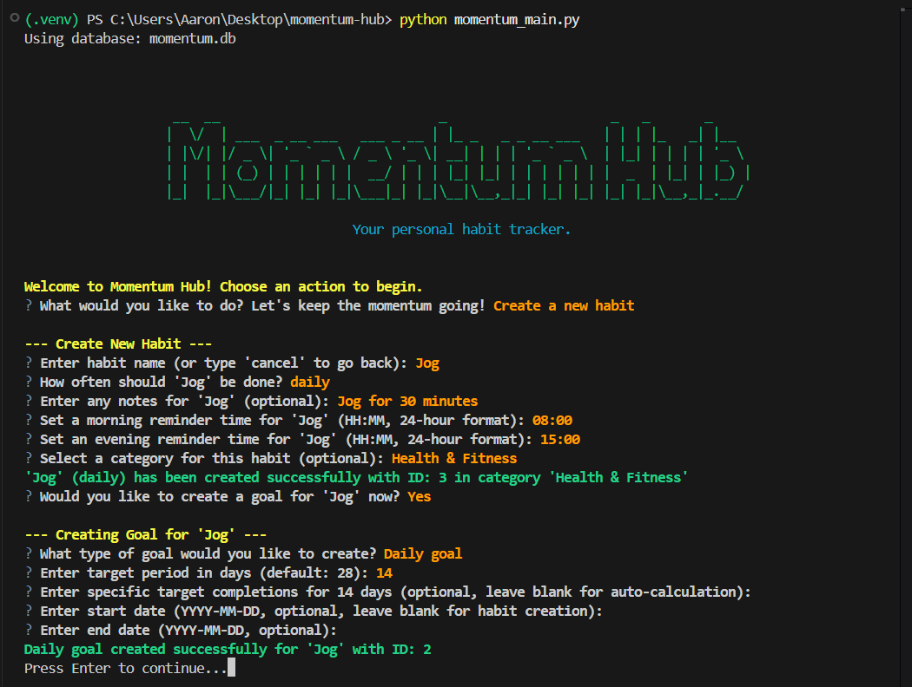
*The main menu showing all available options for habit management, analytics, and data operations.*

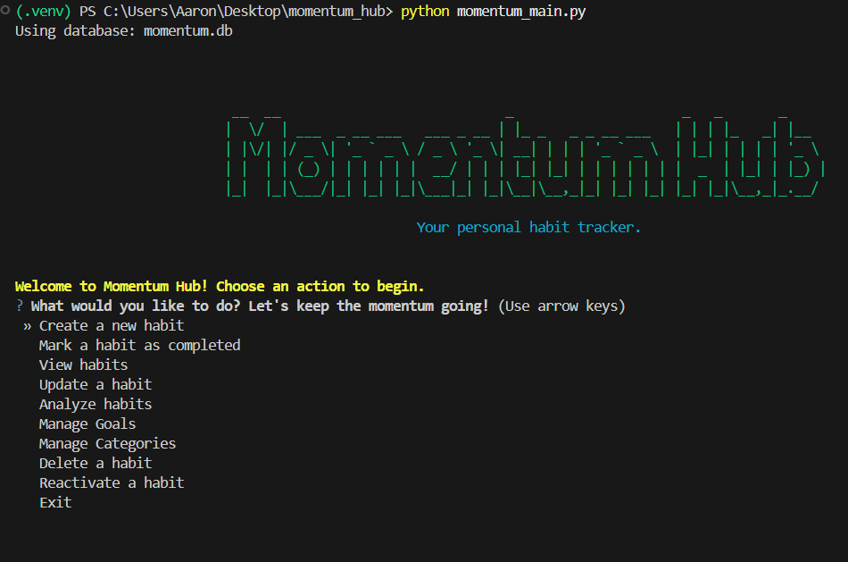
*Live run of the CLI showing the main menu and available actions.*

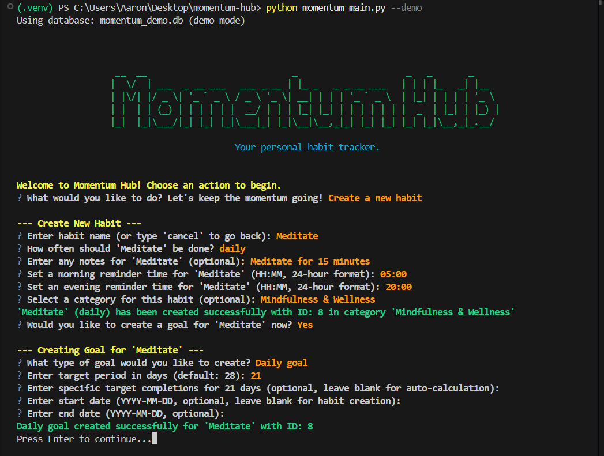
*Interactive form for creating new habits with frequency selection, reminders, and category assignment.*

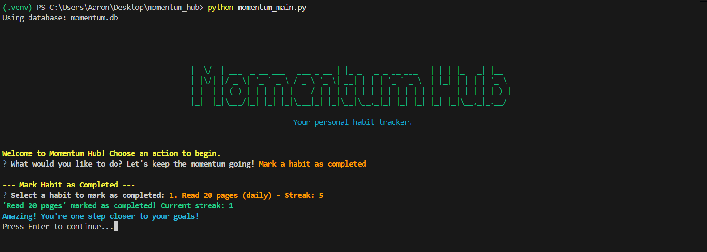
*Marking a habit as completed with confirmation and streak update.*

### Analytics Output
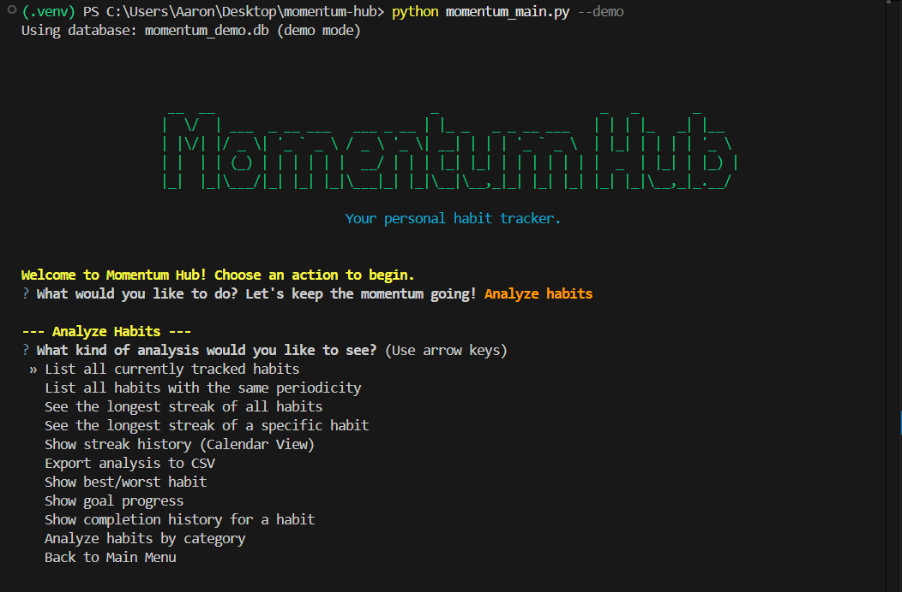
*Analytics options menu showing available insights and reports.*

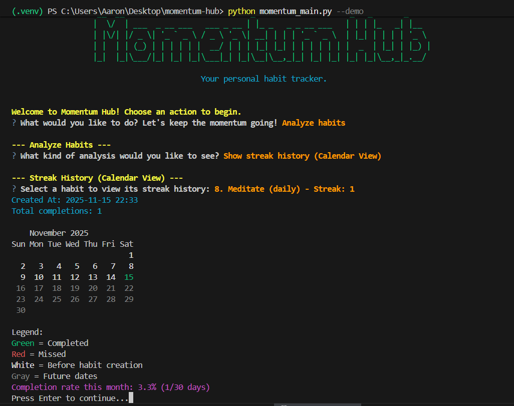
*Calendar view showing streak history and completion rate.*

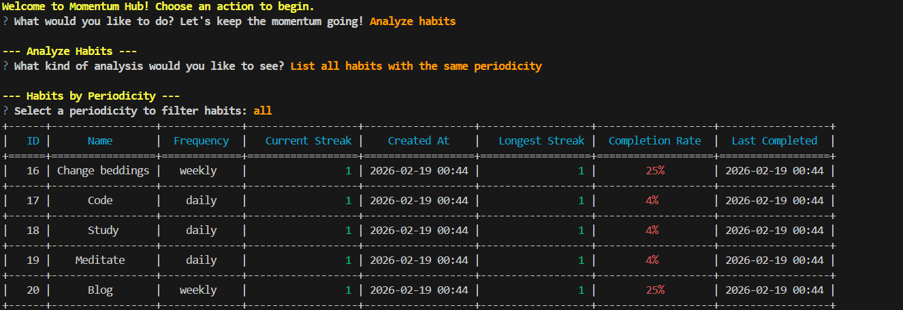
*Analytics table showing current and longest streaks across habits.*

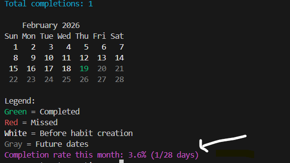
*Calendar view showing completion rate for the selected habit.*

### Data Views
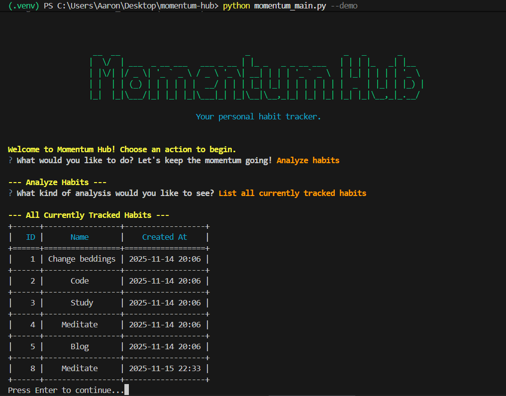
*Overview of all habits with their current status, streaks, and completion information.*

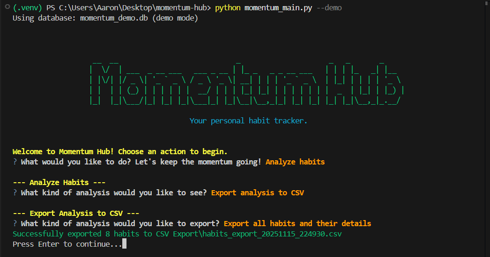
*Data export interface allowing users to download habits, completions, and analytics data.*

### Test Evidence
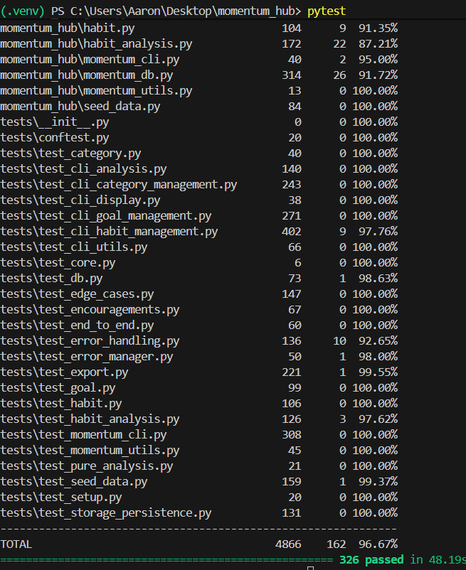
*Latest test run showing coverage summary output.*

## 8. Usage

Common commands:

```bash
# Use a custom database file
python momentum_main.py --db my_habits.db

# Use a custom demo database via environment variable
MOMENTUM_DEMO_DB=my_demo.db python momentum_main.py --demo

# Run the app with a specific database and debug output
MOMENTUM_DB=work_habits.db python momentum_main.py
# Launch demo mode
python momentum_main.py --demo

# Get help
python momentum_main.py --help
```

The demo database (`momentum_demo.db`) is separate from the primary data.
The primary database file (`momentum.db`) is created locally on first run and is not included in the repository, so new users start with an empty database unless they explicitly use demo mode or seed data.

### Documentation
- **[API Documentation](docs/api.md)**: Comprehensive API reference for developers
- **[Usage Guide](USAGE.md)**: Advanced usage patterns and reviewer workflows
- **[Design Notes](DESIGN.md)**: Architecture rationale, streak logic, and demo isolation details
- **[Presentation Guide](PRESENTATION_GUIDE_20_5.md)**: Complete rubric-aligned presentation breakdown
- **[Submission Guide](QUICK_START_SUBMISSION.md)**: Quick steps for evaluation submission
- **[Final Submission Package](FINAL_SUBMISSION_PACKAGE.md)**: Complete deliverables summary
- **[Submission Checklist](SUBMISSION_CHECKLIST.md)**: Rubric + lecturer feedback checklist

## 9. Architecture

Momentum Hub follows a clean, modular architecture designed for maintainability and extensibility. The following diagrams provide visual representations of the system's structure, automatically generated from the actual codebase.

### ASCII Architecture Diagram
```
CLI Layer
  └─ momentum_hub/cli_*  -> User input and menus
Core Models
  └─ Habit, Goal, Category
Persistence
  └─ momentum_hub/momentum_db.py (SQLite)
Analytics
  └─ momentum_hub/habit_analysis.py (pure functions)
Utilities
  └─ momentum_hub/cli_utils.py, momentum_hub/momentum_utils.py
```

### Design Decisions
- **Separation of concerns**: CLI flows live in `momentum_hub/cli_*`, persistence in `momentum_hub/momentum_db.py`, and analytics in `momentum_hub/habit_analysis.py` to keep UI, storage, and logic decoupled.
- **Pure analytics functions**: Streak and completion-rate calculations are implemented as pure functions so they are deterministic and easy to unit-test.
- **Periodicity‑correct streaks**: Weekly streaks are computed by week boundaries (Sunday-start weeks) to prevent multiple completions in one week from inflating streaks.

### Tradeoffs
- **Centralized DB module**: Persistence is kept in a single module for clarity and testability. Splitting into multiple DB files was avoided to reduce refactor risk close to submission.
- **Static typing in CI**: `mypy` is configured for local checks, but strict CI enforcement was not added to avoid failures caused by third‑party stubs under limited time.

#### **System Architecture Diagram**
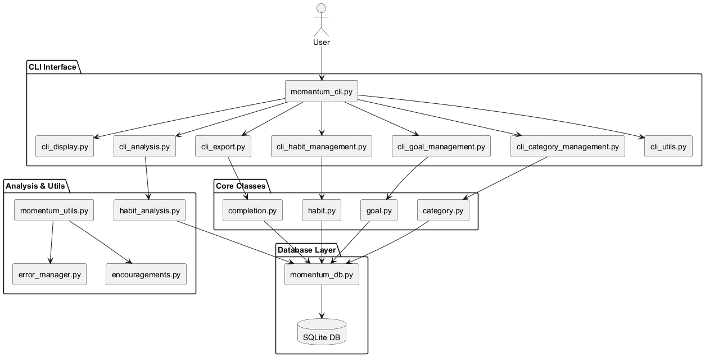

*High-level overview showing the layered architecture with clear separation of concerns: CLI interface layer, core business logic, database persistence, and supporting utilities. This diagram illustrates how user interactions flow through the application layers.*

#### **Component Diagram**
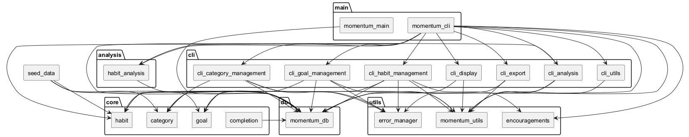

*Detailed component relationships and dependencies between modules. Shows how CLI modules interact with core classes and database operations, highlighting the modular design that enables easy feature additions and maintenance.*


#### **Class Diagram**
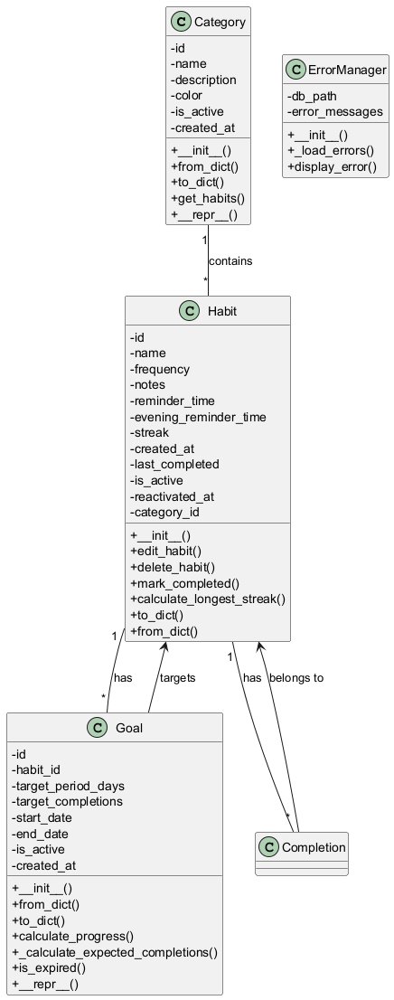


*Object-oriented design showing the main classes (Habit, Category, Goal, Completion) with their attributes and methods. This diagram helps developers understand the data models and business logic encapsulation.*

#### **Sequence Diagram**
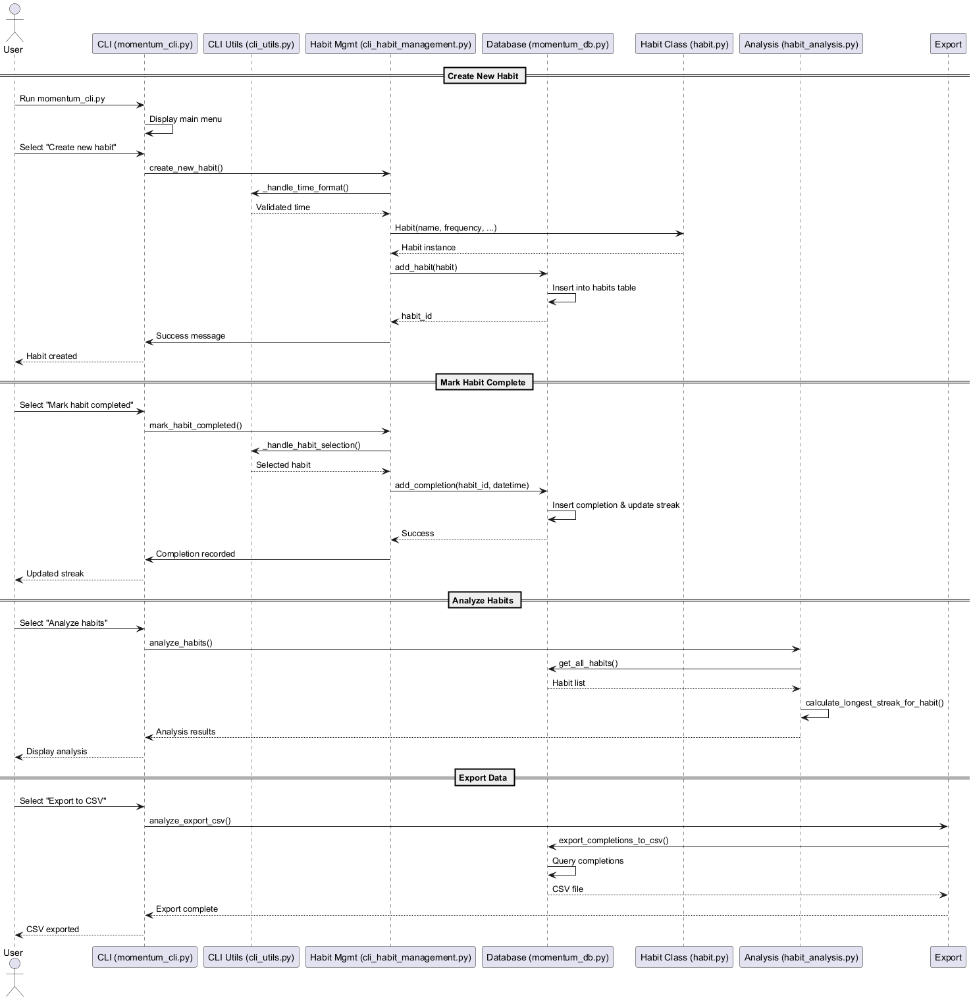

*Illustrates the flow of operations showing user interactions, database operations, and module communications for key features like habit creation, completion marking, analysis, and data export.*

#### **Deployment Diagram**
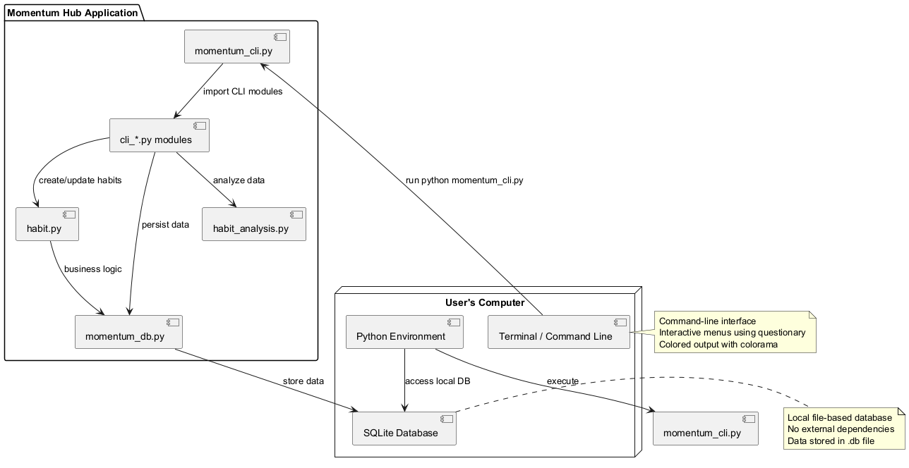

*Shows how the application is deployed with local SQLite database, Python runtime, and file system interactions. Illustrates the deployment architecture and dependencies.*

#### **Module Mapping Diagram**
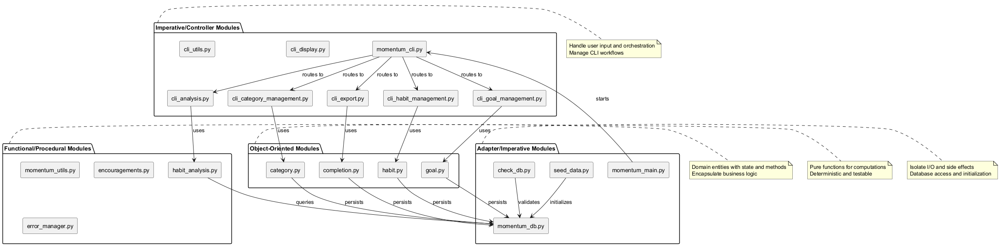

*Visual representation of code organization showing modules grouped by programming paradigms (Object-Oriented, Functional/Procedural, Imperative/Controller, Adapter/Imperative) and their responsibilities.*

#### **Data Flow Diagram**
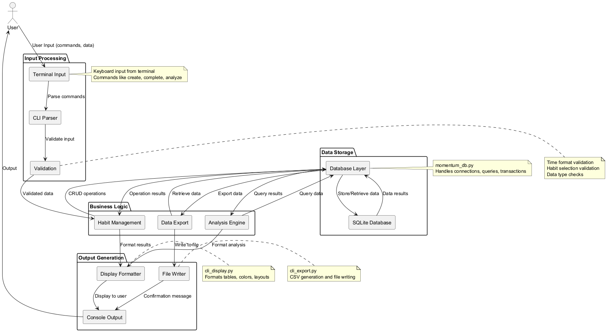

*Shows how data moves through the system from user input through validation, business logic, database operations, and output generation. Illustrates data processing and storage patterns.*

#### **Package Diagram**
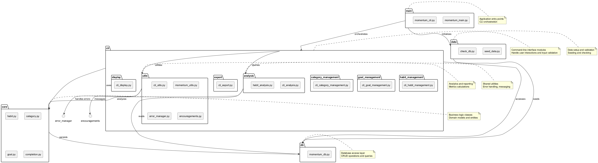

*High-level package organization showing main packages (cli, core, db, analysis, utils, main, data) and their dependencies. Shows the overall package structure and imports.*

#### **Core Components:**
- **`momentum_main.py`**: Application entry point and CLI argument parsing
- **`momentum_cli.py`**: Main CLI interface and menu system
- **`momentum_db.py`**: Database operations and data persistence layer
- **`habit.py`**: Core habit model with business logic
- **`goal.py`**: Goal management and progress tracking
- **`category.py`**: Category system for habit organization

#### **CLI Modules:**
- **`cli_habit_management.py`**: Habit CRUD operations
- **`cli_goal_management.py`**: Goal creation and management
- **`cli_category_management.py`**: Category organization
- **`cli_analysis.py`**: Analytics and reporting features
- **`cli_export.py`**: Data export functionality

#### **Supporting Modules:**
- **`habit_analysis.py`**: Advanced analytics calculations
- **`seed_data.py`**: Demo data generation
- **`cli_utils.py`**: Shared CLI utilities and helpers
- **`error_manager.py`**: Centralized error handling

###  Key Design Patterns

#### **Data Flow:**
```
CLI Input -> Validation -> Business Logic -> Database -> Response
```

#### **Error Handling:**
- Centralized error management with user-friendly messages
- Graceful degradation for edge cases
- Comprehensive logging for debugging

#### **Database Design:**
- SQLite with proper indexing for performance
- ACID compliance for data integrity
- Migration-safe schema design

###  Performance Characteristics

- **Startup Time**: < 2 seconds (typical)
- **Database Operations**: Optimized queries with proper indexing
- **Memory Usage**: Minimal footprint suitable for CLI applications
- **Concurrent Access**: SQLite locking handles single-user scenarios

**Complexity Note:** Analytics functions (streaks, completion rates) run in linear time relative to the number of completion records processed (O(n)). Database reads are dominated by SQLite query costs and benefit from indexing on primary keys and foreign keys.

### Glossary
- **Current streak**: Consecutive completions up to the most recent completion date.
- **Longest streak**: Maximum number of consecutive completions across the habit history.
- **Periodicity**: The habit interval (daily or weekly) that defines streak boundaries.

###  Customization & Extensibility

#### **Adding New Habit Types:**
1. Extend the `Habit` class in `habit.py`
2. Update frequency validation in `cli_utils.py`
3. Add corresponding CLI handlers

#### **Custom Analytics:**
1. Extend `habit_analysis.py` with new calculation methods
2. Add CLI menu options in `cli_analysis.py`
3. Update display formatting as needed

#### **Database Schema Extensions:**
1. Modify table definitions in `momentum_db.py`
2. Add migration logic for existing databases
3. Update model classes accordingly

### Core Workflows

#### Habit Management
- **Create**: Add new habits with custom frequencies, reminders, and categories
- **Update**: Modify habit details, frequencies, or settings
- **Delete/Reactivate**: Soft delete habits and bring them back when ready
- **Categorize**: Group habits by themes (Health, Productivity, Learning, etc.)

#### Analytics & Insights
- **Streak Tracking**: Monitor current and longest streaks
- **Completion Rates**: View success rates over time periods
- **Calendar Views**: Visual calendar showing completion patterns
- **Best/Worst Analysis**: Identify the most and least successful habits
- **Goal Progress**: Track progress toward specific targets

#### Data Management
- **Export to CSV**: Download habits, completions, or analytics data
- **Backup Safety**: Automatic backup creation before destructive operations
- **Category Analysis**: View statistics grouped by categories

### Example Session
```
Welcome to Momentum Hub!
Your personal habit tracker.

What would you like to do->
 Create a new habit
  Mark a habit as completed
  View habits
  Analyze habits
  Create goal
  Exit
```

### Example Workflow (Create → Complete → Analyze)
```
Welcome to Momentum Hub!
Your personal habit tracker.

What would you like to do-> Create a new habit
Habit created successfully.

What would you like to do-> Mark a habit as completed
'Read 20 pages' marked as completed! Current streak: 1

What would you like to do-> Analyze habits
Habits by Periodicity -> all
```


## 10. Contributing

Contributions are welcome. To get started:

1. **Fork the repository**
2. **Clone the fork**:
   ```bash
   git clone https://github.com/yourusername/momentum-hub.git
   cd momentum-hub
   ```

3. **Set up development environment**:
   ```bash
   pip install -e .[dev]
   ```

4. **Run tests**:
   ```bash
   pytest
   ```

5. **Create a feature branch**:
   ```bash
   git checkout -b feature/amazing-new-feature
   ```

6. **Make changes and add tests**

7. **Run the full test suite**:
   ```bash
   pytest --cov=src
   ```

8. **Submit a pull request**

### Development Guidelines
- Follow PEP 8 style guidelines
- Add tests for new features
- Update documentation as needed
- Use type hints where appropriate
- Keep the CLI user-friendly and intuitive

### Pull Request Process
1. Ensure all tests pass and coverage remains above 80%
2. Update documentation for any new features
3. Add appropriate type hints
4. Follow commit message conventions
5. Request review from maintainers

### Issue Reporting
- Use the issue templates provided
- Include steps to reproduce
- Provide system information (OS, Python version)
- Attach relevant screenshots if applicable

### Feature Requests
- Check existing issues first
- Provide detailed use cases
- Consider backward compatibility
- Include mockups if proposing UI changes

## 11. Testing & Quality Assurance

### Running Tests
```bash
# Run all tests
pytest

# Run with coverage report
pytest --cov --cov-report=term-missing

# Run analytics tests with deterministic fixture data
pytest tests/test_habit_analysis.py tests/test_streaks.py

# Run specific test file
pytest tests/test_habit.py

# Run tests in verbose mode
pytest -v
```

Note: The analytics test fixture uses a fixed base date to generate deterministic 4-week time-series data (see `tests/test_data.py`), ensuring reproducible streak and completion-rate results across runs.

### Testing Strategy
- **Unit tests** validate core models and pure analytics logic (streaks, completion rates, and goal progress).
- **Integration tests** exercise database persistence and CLI workflows with isolated temporary databases.
- **Deterministic fixtures** provide reproducible time-series data for 4-week analytics verification.

### Static Type Checking
Static type checking is supported via `mypy`. The configuration lives in `pyproject.toml` under `[tool.mypy]` and is intentionally conservative to avoid false positives while still enforcing basic consistency.

### Requirements Mapping
- **CRUD operations**: Implemented in `momentum_hub/cli_habit_management.py` and `momentum_hub/momentum_db.py`, covered by tests in `tests/test_db.py` and `tests/test_cli_habit_management.py`.
- **Analytics**: Implemented in `momentum_hub/habit_analysis.py` and `momentum_hub/cli_analysis.py`, covered by `tests/test_habit_analysis.py` and `tests/test_streaks.py`.
- **Periodicity‑correct streaks**: Enforced in `momentum_hub/habit.py` and `momentum_hub/momentum_db.py`, validated in `tests/test_habit.py` and `tests/test_edge_cases.py`.

### Test Coverage
The project maintains high test coverage (90%+) across all core modules including:
- Core habit functionality
- Database operations
- CLI interfaces
- Analysis features
- Export functionality
- Goal management
- Category organization

### Code Quality Tools
- **Pre-commit hooks**: Automated code formatting and linting with:
  - `black` (code formatting)
  - `isort` (import sorting)
  - `flake8` (linting)
  - `mypy` (type checking)
- **Type hints**: Comprehensive type annotations throughout the codebase
- **PEP 8 compliance**: Consistent code style and formatting
- **GitHub Actions CI/CD**: Automated testing and quality checks

## 12. Development Setup

### Prerequisites
- Python 3.10+
- Git
- Virtual environment (recommended)

### Setup Steps
```bash
# Clone repository
git clone https://github.com/yourusername/momentum-hub.git
cd momentum-hub

# Create virtual environment
python -m venv .venv
source .venv/bin/activate  # On Windows: .venv\Scripts\activate

# Install in development mode
pip install -e .[dev]

# Install pre-commit hooks
pre-commit install

# Run initial tests
pytest
```

### Code Formatting
```bash
# Format code with pre-commit
pre-commit run --all-files

# Or manually format
black .
isort .
```

### Development Scripts

The `scripts/` directory contains several development utilities:

- **`scripts/seed_demo_db.py`**: Advanced demo database seeding with customizable options
- **`scripts/generate_arch_diagrams.py`**: Generate architecture diagrams from code
- **`scripts/generate_code_based_diagrams.py`**: Create UML diagrams automatically
- **`scripts/seed_data.py`**: Production seed data management

### Database Schema

The application uses SQLite with the following core tables:

- **`habits`**: Habit definitions with metadata and settings
- **`completions`**: Completion records with timestamps
- **`goals`**: Goal definitions with target periods and completions
- **`categories`**: Category organization for habits
- **`errors`**: Centralized error message storage

All tables include proper foreign key relationships and indexing for performance.

### Error Handling Architecture

The application features a centralized error management system (`error_manager.py`) that provides:

- User-friendly error messages with customizable formatting
- Database-backed error message storage
- Graceful error recovery and user guidance
- Comprehensive error logging for debugging

### Backup & Safety Features

Before destructive operations, the application automatically creates backups:

- Database backups are stored in the `backups/` directory
- CSV exports are timestamped and stored in `CSV Export/`
- Backup creation is handled transparently by maintenance scripts

## 13. Limitations and Future Improvements

As a CLI-based habit tracker developed for a school assignment, Momentum Hub has some inherent limitations while providing a solid foundation for habit tracking:

### Current Limitations
- **CLI-Only Interface**: As required for the assignment, the app is command-line only, which may limit accessibility for users preferring graphical interfaces
- **Local Data Storage**: Uses SQLite database stored locally, requiring manual backup and limiting multi-device synchronization
- **Single-User Design**: Built for individual use without multi-user or social features
- **Performance Considerations**: SQLite is suitable for personal use but may require optimizations for very large datasets

### Potential Future Enhancements
- **Web/Mobile Interfaces**: Browser-based or mobile app versions for broader accessibility
- **Cloud Synchronization**: Multi-device data syncing with cloud storage
- **Social Features**: Habit sharing, challenges, and community interactions
- **Advanced Analytics**: AI-powered insights, predictive analytics, and personalized recommendations
- **Gamification**: Achievement systems, streaks rewards, and motivational elements
- **Integrations**: Calendar apps, fitness trackers, and productivity tools

These limitations are acknowledged as part of the assignment constraints and design choices. The app successfully demonstrates comprehensive CLI application development while maintaining excellent code quality and user experience within its scope.

## 14. License
This project is licensed under the MIT License. See `LICENSE` for details.
## 15. Links

- [Homepage](https://github.com/aaronmalunga/momentum-hub)
- [Documentation](https://github.com/aaronmalunga/momentum-hub#readme)
- [Issues](https://github.com/aaronmalunga/momentum-hub/issues)
- [Repository](https://github.com/aaronmalunga/momentum-hub.git)

Built with modern Python libraries including:
- [Questionary](https://github.com/tmbo/questionary) - Interactive prompts
- [Colorama](https://github.com/tartley/colorama) - Cross-platform colors
- [Tabulate](https://github.com/astanin/python-tabulate) - Beautiful tables
- [PyFiglet](https://github.com/pwaller/pyfiglet) - ASCII art

---

**Start building better habits today with Momentum Hub!**

## Academic Integrity & AI Usage
AI tools were used in this project as supplementary learning and review aids, primarily for conceptual clarification, debugging support, and improving documentation clarity. All design decisions, implementation logic, and unit tests were independently developed and fully understood before inclusion. AI suggestions were critically evaluated and adapted where necessary. The final submission reflects my own work and understanding of the course concepts.

### Authorship
This project was designed and implemented as part of the OOFPP portfolio course. All core design decisions, algorithms, and implementation details were developed independently by the author unless otherwise referenced.

### External Resources
The following resources were consulted during the development of this project for reference and conceptual clarification:

- Python 3 Official Documentation - `https://docs.python.org/3/` (Reference for language features, standard library modules such as `datetime`, `sqlite3`, and testing utilities.)
- SQLite Documentation - `https://www.sqlite.org/docs.html` (Guidance on database structure, queries, and file-based persistence design.)
- Pytest Documentation - `https://docs.pytest.org/` (Reference for structuring unit tests, fixtures, and deterministic test design.)
- General tutorials and technical discussions on Python project structure, modular design, and CLI application development.

All code was written independently and adapted to the specific requirements of the OOFPP portfolio project.
